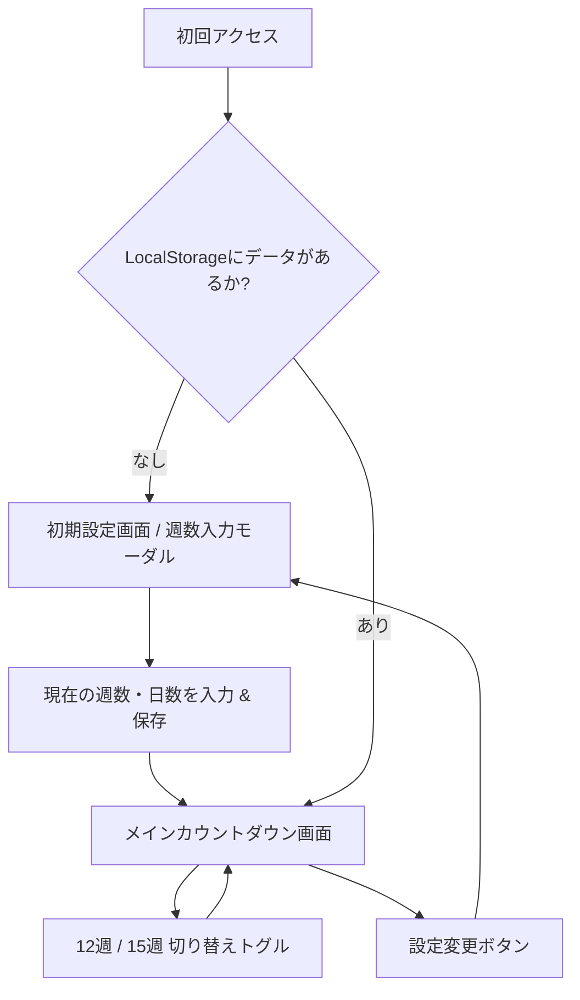

# PRD.md - つわりカウントダウンアプリ (tsuwarin) プロダクト要求仕様書

---

## 1. プロダクト概要

### 1.1 プロダクト名
**つわりカウントダウン (`tsuwarin`)**

### 1.2 背景と課題
- **背景**: 妊娠初期の妊婦の多くが経験する「つわり（悪阻）」は、激しい吐き気、嘔吐、全身倦怠感、頭痛などを伴い、日常生活に甚大な支障をきたします。一般につわりは妊娠5〜6週頃から始まり、8〜10週頃にピークを迎え、胎盤が完成に近づく12週〜16週頃（妊娠4ヶ月〜安定期）に徐々に軽減・終息すると言われています。
- **課題**: つわりの苦しみの中で最も精神を削るのは**「この苦しみがいつ終わるのか分からないという絶望感」**です。日々の苦痛の中で「あとどれくらい耐えればいいのか」が見えないと、1日1日が果てしなく長く感じられます。
- **解決策**: 現在の妊娠週数（何週何日）を入力するだけで、つわりの出口の大きな節目となる「12週」「15週」までの残り時間を日・時間単位でリアルタイムにカウントダウンし、「確実にゴールに向かって進んでいること」を可視化するスマホ向けWebアプリを提供します。

### 1.3 ビジョン & コアバリュー
- **「耐えているすべての秒に、ゴールへの前進という価値を。」**
- 体調が最悪な状態でもストレスなく使える、優しく温かみのあるシンプルな体験。
- 会員登録不要・完全無料・完全端末内完結（プライバシー保護）。

---

## 2. ターゲットユーザー & ペルソナ

### 2.1 メインターゲット: 妊娠初期の妊婦（妊娠5週〜14週頃）
- **ペルソナ**:
  - 年齢: 20代〜30代後半
  - 状況: つわりで一日中横になっており、スマホを触るのもだるい・画面の強い光や派手な動きで酔ってしまう。
  - ニーズ: 「あと何日、何時間で12週（または15週・安定期）になるのかすぐ知りたい」「少しでも心の支えになるポジティブな励ましが欲しい」。

### 2.2 サブターゲット: 妊婦のパートナー
- **ペルソナ**:
  - パートナーがつわりに苦しんでいるが、具体的にいつ頃がピークの出口なのかを正確に把握できていない。
  - ニーズ: 「いつまでが一番辛い時期なのか目安を知り、適切なサポートや声かけを行いたい」。

---

## 3. ゴールと指標（KPI）

1. **ユーザー体験の即時性**: 初回アクセスから週数入力・カウントダウン表示完了まで **10秒以内**。
2. **再訪性**: 毎日の進捗確認として、スマホのホーム画面やブックマークからストレスなく再閲覧できる（LocalStorageによる入力省略）。
3. **視覚的安らぎ**: 明るすぎる白やコントラストの高すぎる原色を避け、画面酔いしないリラックスデザイン。

---

## 4. 機能要件 (Functional Requirements)

### FR-1: 週数・日数の入力と自動進行
- **入力項目**: 現在の「週数（0〜40週）」および「日数（0〜6日）」。
- **基準日時の自動記録**:
  - 週数・日数を設定した時点のブラウザ時刻（タイムスタンプ）を「基準日時」として保存する。
- **自動時間進行（リアルタイム反映）**:
  - 設定後、時間が経過すると自動的に残り時間が減少し、週数・日数も進む。
  - アプリを閉じても、次回アクセス時に基準日時からの経過時間をミリ秒単位で再計算し、正確な最新状態を即座に表示する。

### FR-2: 目標週数（ターゲット）の切り替え機能
ユーザーはワンタップで目標マイルストーンを切り替え可能とする。
1. **12週0日 (妊娠12週目 = 84日目)**:
   - つわりの第一の節目（ホルモン分泌のピークを過ぎ、胎盤形成が本格化する目安）。
2. **15週0日 (または15週6日/16週0日・安定期目安 = 105日目)**:
   - 妊娠4ヶ月末（妊娠16週からのいわゆる「安定期」突入直前の目安）。
- 切り替えタブ/トグルボタンで即座に表示が切り替わり、選択状態もLocalStorageに記憶される。

### FR-3: 残り時間の表示フォーマット
ユーザー指定の必須フォーマットおよび補足表示をわかりやすく構成する。
- **メイン表示**:
  - **「W週D日 {目標週}週目まであとh時間(d日)」**
    - 例: `9週3日 12週目まであと432時間(18日)`
    - 例: `11週6日 12週目まであと3時間(1日)`
- **マイルストーン達成時の表示**:
  - すでに12週（または15週）に到達している場合は、「12週目を迎えました！本当にお疲れ様でした💐体調はいかがですか？」といった祝福・ねぎらいのメッセージを表示する。

### FR-4: 設定の永続化とリセット (LocalStorage)
- 入力した週数、日数、設定時の基準日時、選択中のターゲット（12週/15週）を `localStorage` に自動保存。
- 再訪時は入力フォームを介さず、直ちにカウントダウン画面を表示。
- 設定変更ボタン（歯車アイコンまたは編集リンク）から、いつでも週数の修正・リセットが可能。

### FR-5: 励ましメッセージ（温かい寄り添い）
- つわり中の妊婦さんの心に寄り添う、短く優しいメッセージ（例:「今日も1日耐えてえらい！」「赤ちゃんもすくすく育っています」など）をランダムまたは日替わりで添える。

---

## 5. 非機能要件 (Non-Functional Requirements)

| カテゴリ | 要件内容 |
| :--- | :--- |
| **ホスティング環境** | GitHub Pages (`main` ブランチのルート公開)。ビルドプロセス不要の静的配信。 |
| **コード設計** | カスタマイズ・保守性向上のため、HTML (`index.html`)、CSS (`css/style.css`)、JS (`js/app.js` 他) を物理的に別ファイルに分離。 |
| **対応デバイス** | スマートフォンファースト（iPhone Safari / Android Chrome、画面幅 360px〜430px 最適化）。タブレット・PCでも中央配置で自然に閲覧可能。 |
| **表示パフォーマンス** | ファーストビュー表示速度 1秒以内（Lighthouse Performance 95点以上目標）。外部CDNへの依存はGoogle Fonts等最小限に抑える。 |
| **プライバシー** | 外部サーバーとの通信は一切行わず、ユーザーの妊娠情報は端末内のLocalStorageのみに保存。トラッキングや広告は配置しない。 |
| **アクセシビリティ** | 文字のコントラスト比 4.5:1 以上確保、タップターゲット 44px 以上、フォントサイズは小さすぎない 16px 以上を基本とする。 |
| **視覚負荷低減** | つわりによる画面酔いを防止するため、強いコントラストや激しいアニメーションを排除し、淡く落ち着いたアースカラー／パステルトーンを採用。 |

---

## 6. 画面一覧・ユーザー体験フロー

1. **初期入力画面**:
   - スッキリしたピッカー（週数セレクト: 0〜40週、日数セレクト: 0〜6日）。
   - 「カウントダウンを始める」ボタン。
2. **メイン画面**:
   - 今日の現在週数（例: `9週3日`）。
   - 切り替えスイッチ（`12週まで` / `15週まで`）。
   - メインカウントダウン表示（`あと 432時間 (18日)`）。
   - プログレスバー & 進捗パーセント。
   - 励ましメッセージ。
   - フッター: 週数の再設定 / リセットリンク。

---

## 7. 将来の拡張候補（フェーズ2以降）
- **出産予定日からの逆算設定**: 予定日または最終月経開始日を入れると、自動で今日現在の週数を算出する機能。
- **PWA（Progressive Web App）対応**: `manifest.json` と ServiceWorker によるオフライン動作、およびスマホのホーム画面追加時のネイティブライク表示。
- **パートナー共有機能**: 現在の設定をURLクエリパラメータ（例: `?w=9&d=3&t=...`）に変換し、LINE等で共有できるリンク生成。
