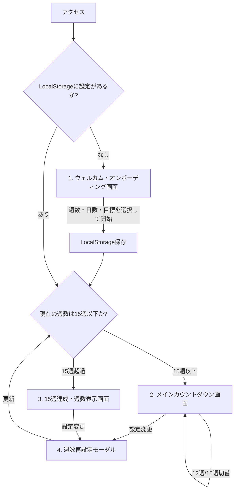

# PRD.md - つわりカウントダウンアプリ (tsuwarin) プロダクト要求仕様書

---

## 1. プロダクト概要

### 1.1 プロダクト名
**つわりカウントダウン (`tsuwarin`)**

### 1.2 背景と課題
- **背景**: 妊娠初期の妊婦の多くが経験する「つわり（悪阻）」は、激しい吐き気、嘔吐、全身倦怠感、頭痛などを伴い、日常生活に甚大な支障をきたします。一般につわりは妊娠5〜6週頃から始まり、8〜10週頃にピークを迎え、胎盤が完成に近づく12週〜16週頃（妊娠4ヶ月〜安定期）に徐々に軽減・終息すると言われています。
- **課題**: つわりの苦しみの中で最も精神を削るのは**「この苦しみがいつ終わるのか分からないという絶望感」**です。日々の苦痛の中で「あとどれくらい耐えればいいのか」が見えないと、1日1日が果てしなく長く感じられます。
- **解決策**: 現在の妊娠週数（何週何日）を入力するだけで、つわりの出口の大きな節目となる「12週」「15週」までの残り時間を日・時間単位でリアルタイムにカウントダウンし、「確実にゴールに向かって進んでいること」を可視化するスマホ向けWebアプリを提供します。

### 1.3 ビジョン & コアバリュー
- **「耐えているすべての秒に、ゴールへの前進という価値を。」**
- 体調が最悪な状態でもストレスなく使える、優しく温かみのあるシンプルな体験。
- 会員登録不要・完全無料・完全端末内完結（プライバシー保護）。

---

## 2. ターゲットユーザー & ペルソナ

### 2.1 メインターゲット: 妊娠初期の妊婦（妊娠5週〜14週頃）
- **ペルソナ**:
  - 年齢: 20代〜30代後半
  - 状況: つわりで一日中横になっており、スマホを触るのもだるい・画面の強い光や派手な動きで酔ってしまう。
  - ニーズ: 「あと何日、何時間で12週（または15週・安定期）になるのかすぐ知りたい」「少しでも心の支えになるポジティブな励ましが欲しい」。

### 2.2 サブターゲット: 妊婦のパートナー
- **ペルソナ**:
  - パートナーがつわりに苦しんでいるが、具体的にいつ頃がピークの出口なのかを正確に把握できていない。
  - ニーズ: 「いつまでが一番辛い時期なのか目安を知り、適切なサポートや声かけを行いたい」。

---

## 3. ゴールと指標（KPI）

1. **ユーザー体験の即時性**: 初回アクセスから週数入力・カウントダウン表示完了まで **10秒以内**。
2. **再訪性**: 毎日の進捗確認として、スマホのホーム画面やブックマークからストレスなく再閲覧できる（LocalStorageによる入力省略）。
3. **視覚的安らぎ**: 明るすぎる白やコントラストの高すぎる原色を避け、画面酔いしないリラックスデザイン。

---

## 4. 機能要件 (Functional Requirements)

### FR-1: 初回オンボーディング & 週数入力
- **初回アクセス時のオンボーディング画面**:
  - 初回アクセス時（LocalStorage未設定時）は、メインカードの代わりに優しい「ウェルカム画面（初期オンボーディング画面）」を表示する。
  - 入力項目:
    - 現在の「週数（0〜40週）」および「日数（0〜6日）」
    - 最初のカウントダウン目標（「12週まで」または「15週まで」の選択）
  - 「カウントダウンをはじめる」ボタンを押下することで、基準日時（タイムスタンプ）を保存し、メイン画面へとスムーズに移行する。
- **自動時間進行（カレンダー日付 0:00 基準）**:
  - 設定した日（例: 9月20日）の時点で「9週3日」とした場合、**カレンダーの日付が変わった瞬間（深夜 0:00）に自動で「9週4日」へと繰り上がる**。
  - カウントダウン目標（12週0日 / 15週0日）は、そのカレンダー期日の深夜 0:00:00 をターゲットとし、現在時刻とのミリ秒差分から「あと○時間○分」をリアルタイムに計算する。
  - アプリを閉じても、次回アクセス時にカレンダー日付と現在時刻から最新状態を即座に再計算して同期する。

### FR-2: 目標週数（ターゲット）の切り替え機能
初期設定（オンボーディング）で選択した目標マイルストーンを基準とし、必要に応じて設定（⚙️）または節目達成画面から切り替え可能とする。
1. **12週0日 (妊娠12週目 = 84日目)**:
   - つわりの第一の節目（ホルモン分泌のピークを過ぎ、胎盤形成が本格化する目安）。
2. **15週0日 (または15週6日/16週0日・安定期目安 = 105日目)**:
   - 妊娠4ヶ月末（妊娠16週からのいわゆる「安定期」突入直前の目安）。
- 選択状態はLocalStorageに記憶され、画面中央に常時操作タブを置くノイズを避けて設定モーダル内に集約する。

### FR-3: 残り時間の表示フォーマット & マイルストーン達成後の挙動
ユーザー指定の必須要素を、重複のない美しい1つの統合文字組みブロックとして表現する。
- **メイン表示（カウントダウン中）**:
  - 現在週数（`W週D日`）
  - 目標誘導文（`{目標週}週目まで あと`）
  - 丸みのある特大数字と時間（`h 時間`）
  - 日数の目安（`(約 d日)`）
  - ※二重表示（同じ残り時間を画面内に複数回並べること）を排除し、自然な視線誘導で1ブロックに統合。
- **12週達成時の表示**:
  - 12週（84日）に到達した場合、「12週目を迎えました！本当にお疲れ様でした💐」という祝福メッセージと、15週目標への切り替えボタンを表示する。
- **15週経過後の表示（安定期以降）**:
  - **15週を過ぎた場合（15週0日以降 / 16週以降）は、カウントダウン表示を行わず「現在の週数を表示するのみ」とする**。
    - 例: `現在 16週2日`
    - 「出口の目安（15週）を通過しました。本当にお疲れ様でした💐」というねぎらいメッセージとともに、シンプルに現在の週数を穏やかに確認できる画面となる。

### FR-4: 設定の永続化とリセット (LocalStorage)
- 入力した週数、日数、設定時の基準日時、選択中のターゲット（12週/15週）、および**最終アクセス日時（`lastAccessTimestamp`）**を `localStorage` に自動保存。
- 再訪時は入力フォームを介さず、直ちにカウントダウン画面（15週超過時は週数表示画面）を表示。
- 設定変更ボタン（歯車アイコンまたは編集リンク）から、いつでも週数の修正・リセットが可能。

### FR-5: 励ましメッセージ（温かい寄り添い）
- つわりを耐えている奥様に寄り添う、短く優しいメッセージを日替わり・ランダムで表示する（JS定数配列で8〜10パターン程度収録）。
  - 例: `「今日も1日耐えてえらい！本当によく頑張っているよ。」`
  - 例: `「赤ちゃんもママと一緒に、一歩ずつ大きくなっているよ🌱」`
  - 例: `「無理せず横になって、ゆっくり休んでね。」`
  - 例: `「食べられる時に、食べられるものだけで大丈夫だよ。」`
  - 例: `「1分1秒、確実にゴールに近づいているよ。」`
  - 例: `「いつでも頼ってね。一緒に乗り越えようね。」`
### FR-6: 前回からの前進・耐えた時間の可視化（耐えた時間バッジ）
- **目的**: つわりの苦痛の中で暗算・引き算をする負担をゼロにし、「前回開いてから自分がどれだけ耐え抜いたか」をひと目で実感できるようにする。
- **仕様**:
  - 前回アプリを開いた（アクセスした）日時と、現在時刻との差分を自動計算。
  - メインカード上部に **「前回から +{h}時間 耐えましたね🌱」** のバッジをそっと表示する。
    - 例: `前回から +3時間 耐えましたね🌱`
    - 例: `前回から +8時間 耐えましたね✨`
    - 例: 24時間以上の場合: `前回から +1日4時間 耐えましたね💐`
  - 初回アクセス時やわずか数分以内の短時間アクセス時はバッジを表示しない。
  - バッジは表示後、数秒〜5秒程度で穏やかにフェードアウトするか、カード内の控えめなサブ情報として定着する。

---

## 5. 非機能要件 (Non-Functional Requirements)

| カテゴリ | 要件内容 |
| :--- | :--- |
| **ホスティング環境** | GitHub Pages (`main` ブランチのルート公開)。ビルドプロセス不要の静的配信。 |
| **コード設計** | カスタマイズ・保守性向上のため、HTML (`index.html`)、CSS (`css/style.css`)、JS (`js/app.js` 他) を物理的に別ファイルに分離。 |
| **対応デバイス** | スマートフォンファースト（iPhone Safari / Android Chrome、画面幅 360px〜430px 最適化）。タブレット・PCでも中央配置で自然に閲覧可能。 |
| **表示パフォーマンス** | ファーストビュー表示速度 1秒以内（Lighthouse Performance 95点以上目標）。外部CDNへの依存はGoogle Fonts等最小限に抑える。 |
| **プライバシー** | 外部サーバーとの通信は一切行わず、ユーザーの妊娠情報は端末内のLocalStorageのみに保存。トラッキングや広告は配置しない。 |
| **アクセシビリティ** | 文字のコントラスト比 4.5:1 以上確保（WCAG 2.1 AA準拠）、タップターゲット 44px 以上。 |
| **視覚負荷低減** | つわりによる画面酔いを防止するため、強いコントラストや激しいアニメーションを排除し、淡く落ち着いたアースカラー／パステルトーンを採用。暗所用のNight Sanctuary（ダークモード）にも対応。 |

---

## 6. 画面一覧・ユーザー体験フロー

1. **ウェルカム・オンボーディング画面（初回）**:
   - やさしい導入メッセージ + 現在週数・日数のピッカー + 目標週（12週 or 15週）の選択。
2. **メインカウントダウン画面（〜15週）**:
   - 明るさ切り替えボタン（Day ☀️ / Night 🌙）
   - 耐えた時間バッジ（`前回から +8時間 耐えましたね🌱`）
   - 統合カウントダウン文字組み（現在週数、目標誘導文、丸い特大数字、時間、日数目安）
   - 夫からの寄り添いメッセージ
3. **15週達成・週数表示画面（15週超）**:
   - 「15週を乗り越えました！体調はいかがですか？💐」というねぎらい。
   - カウントダウンは表示せず、現在の週数（例: `16週2日`）を大きく穏やかに表示。
4. **設定モーダル（再設定）**:
   - いつでも週数・目標の再調整・リセットが可能。

---

## 7. 将来の拡張候補（フェーズ2以降）
- **出産予定日からの逆算設定**: 予定日または最終月経開始日を入れると、自動で今日現在の週数を算出する機能。
- **PWA（Progressive Web App）対応**: `manifest.json` と ServiceWorker によるオフライン動作、およびスマホのホーム画面追加時のネイティブライク表示。
- **パートナー共有機能**: 現在の設定をURLクエリパラメータ（例: `?w=9&d=3&t=...`）に変換し、LINE等で共有できるリンク生成。
